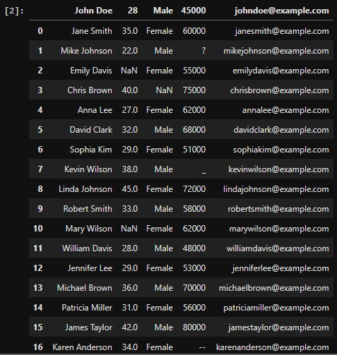
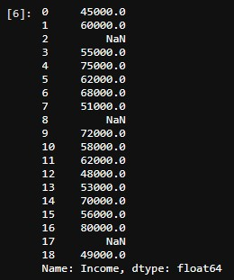
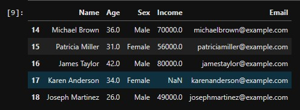

# Introduction to Pandas: Data Reading

In this blog, we'll explore the process of reading and working with data using Pandas. No prior experience is necessary – we'll start from the basics and guide you through every step with simple explanations and practical examples.

By the end of this journey, you'll have the skills to effortlessly import, explore, and make sense of data from various sources. So, let's dive in to it!

Topics
- A. Importing and Reading Data Files
    - A.1. Reading Data
    - A.2. Naming Columns
    - A.3. Handling Missing Values
    - A.4. Using Different Separators
- B. Exploring the Data
- C. Saving the Data


## A. Importing and Reading Data Files

Before we start, let's import our `Pandas` module first.
```python
import pandas as pd
```

### A.1. Reading Data

Reading data is a fundamental step in data analysis, and Pandas simplifies this process by offering functions for importing data from various sources, including CSV, Excel, and databases. 

For this tutorial, I'm going to use a CSV file contaitning the following data. 
```csv
John Doe,28,Male,45000,johndoe@example.com
Jane Smith,35,Female,60000,janesmith@example.com
Mike Johnson,22,Male,,mikejohnson@example.com
Emily Davis,,Female,55000,emilydavis@example.com
Chris Brown,40,,75000,chrisbrown@example.com
Anna Lee,27,Female,62000,annalee@example.com
David Clark,32,Male,68000,davidclark@example.com
Sophia Kim,29,Female,51000,sophiakim@example.com
Kevin Wilson,38,Male,,kevinwilson@example.com
Linda Johnson,45,Female,72000,lindajohnson@example.com
Robert Smith,33,Male,58000,robertsmith@example.com
Mary Wilson,,Female,62000,marywilson@example.com
William Davis,28,Male,48000,williamdavis@example.com
Jennifer Lee,29,Female,53000,jenniferlee@example.com
Michael Brown,36,Male,70000,michaelbrown@example.com
Patricia Miller,31,Female,56000,patriciamiller@example.com
James Taylor,42,Male,80000,jamestaylor@example.com
Karen Anderson,34,Female,,karenanderson@example.com
Joseph Martinez,26,Male,49000,josephmartinez@example.com
```
Like what I mentioned earlier, Pandas has built-in functions for reading different data files. Some of these are `read_csv`, `read_xlsx`, `read_html`, `read_json`, `read_sql`, etc.
```python
# filename
csv_url = "data.csv"

# reading csv files
df = pd.read_csv(csv_url)

df
```
Output:


By calling the `df` variable, we're able to see what the data from our source file.

### A.2. Naming Columns 

As you notice if we call our data table, it sets the first row of text as its column-name/header by default. But in our CSV file, we don't have a header for each column so it set the first row of data as the header. To prevent it from doing so, we can use the `header` argument and set it to `None`.
```python
df = pd.read_csv(csv_url, header=None)
df.head()
```
Output:


By setting our `header` to `None`, we avoided setting the first row as header, and set our header to numbers instead. To name give each column a proper header name, we can use the `names` argument.
```python
df = pd.read_csv(csv_url, header=None, names=["Name", "Age", "Sex", "Income", "Email"])
df.head()
```
Output:


### A.3. Handling Missing Values
If we look back to our table, especially in "Income" column, we will notice some of the missing data got different symbols.
```python
df["Income"]
```
Output:


You can convert these symbols to into `NaN` by mentioning it in the `na_values` argument.
```python
df = pd.read_csv(
    csv_url, 
    header=None, 
    names=["Name", "Age", "Sex", "Income", "Email"], 
    na_values=["?", "_", "--"] # replaces the following character with NaN
)
df["Income"]
```
Output:


### A.4. Using Different Separators
If you ever ran into a CSV with different separator (let's say your data file got `-` instead of `,`), you can use the `delimiter` or `sep` argument.
```python
df = pd.read_csv(
    csv_url, 
    header=None, 
    names=["Name", "Age", "Sex", "Income", "Email"], 
    na_values=["?", "_", "--"] # replaces the following character with NaN
    sep="-" # changes separator
)
```
`sep` and `delimiter` works the same.
```python
df = pd.read_csv(
    csv_url, 
    header=None, 
    names=["Name", "Age", "Sex", "Income", "Email"], 
    na_values=["?", "_", "--"] # replaces the following character with NaN
    delimiter="-" # changes separator
)
```
You can often use `delimiter` or `sep` interchangeably for simple cases where a single character separates values. However, if you need to handle more complex separation patterns or use regular expressions, then `sep` offers more flexibility. 

Here's an example `sep` using a regular expression to separate by either a comma or a semicolon:
```python
df = pd.read_csv('data.csv', sep='[,;]')
```


## B. Exploring the Data

Pandas also has built-in methods for viewing the basic information about our data.
```python
df.info()
```
Output:


The `info()`, from the name itself, returns the basic information about the data table, data such as *Column*, *Dtype (data type)*, etc.

If you want to access the first or last few rows of the table, you can use `head()` and `tail()`.
```python
# head()
df.head()
```
Output:


```python
# tail()
df.tail()
```
Output:


The `head()` returns the first rows of the data table while the `tail()` returns the last rows of the data table. They return 5 rows by default.

 You can pass a number on both functions to specify how many rows do you want to to be returned.
```python
df.head(3)
```
Output:


```python
df.tail(7)
```
Output:


Here are some more functions that will return basic information:

`df.describe()` - Generate summary statistics of numeric columns.
```python
df.describe()
```
Output:


`df.shape` - Get the dimensions of the DataFrame (rows, columns).
```python
df.shape
```
Output:


`df['column_name']` - Access a specific column.
```python
df["Email"]
```


## C. Saving Data

After processing your data, you can save it back to a file or a database using Pandas. For example, to save a DataFrame to a CSV file:
```python
df.to_csv('new_data.csv', index=False)
```
The `index=False` argument prevents Pandas from writing the row indices to the CSV file.

Pandas provides a rich set of functions for data manipulation and analysis, making it a powerful tool for working with tabular data in Python.


In conclusion, data reading with Pandas is an essential and powerful skill for data analysts and scientists. This Python library simplifies the process of importing data from various sources, such as CSV files, Excel spreadsheets, and databases, and provides a user-friendly interface for data exploration. By mastering Pandas' data reading capabilities, professionals can efficiently load, manipulate, and analyze datasets, making it a cornerstone of effective data analysis workflows.
