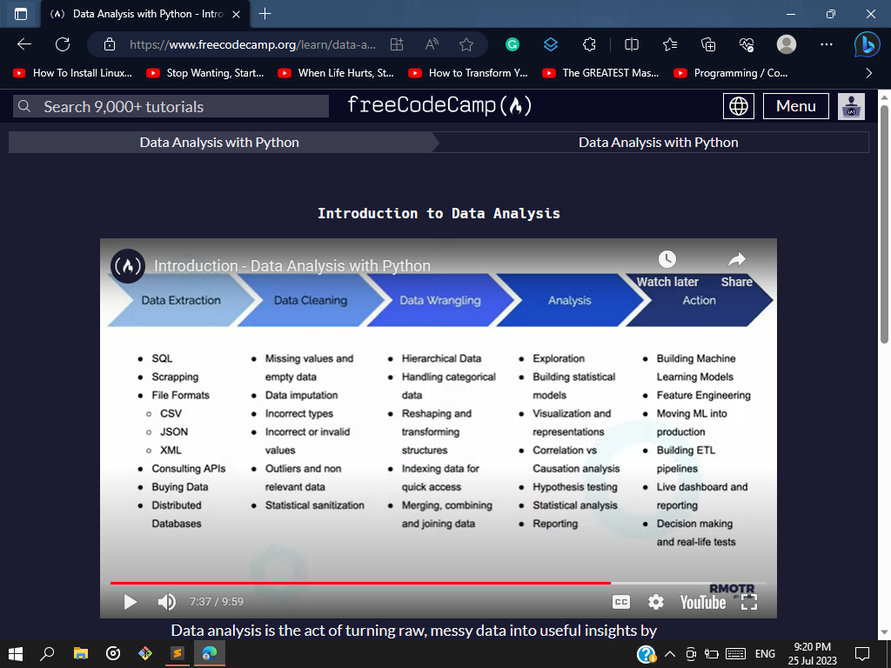
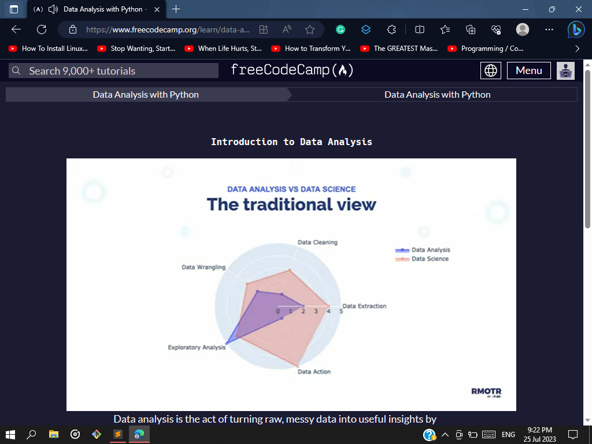
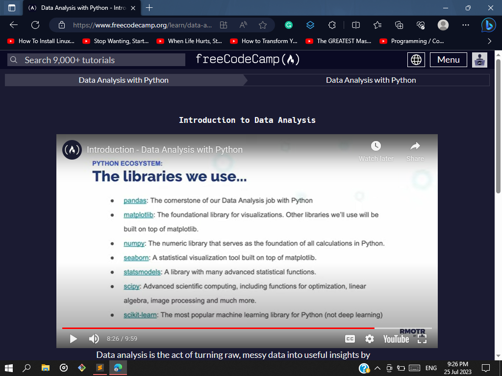
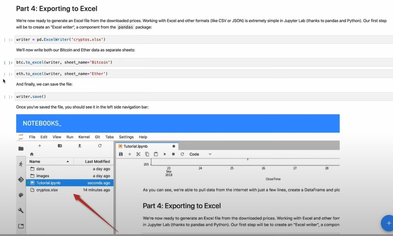
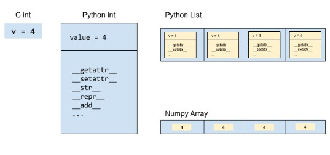

# DATA ANALYSIS

## I. Data Analysis Introduction

### What is Data Analysis
- inspecting/modeling data to find useful information, for better insight and decision making

### Tools
Auto-manage
- Excel
- Tableau
- ZOHO Analytics

Programming Languages
- Python
- R
- Julia

### Data Analysis Process
1. Data Extraction - files from storage, web API, etc.
2. Data Cleaning - 
3. Data Wrangling - Rearranging and reshading data, getting data ready for the next step
4. Analysis - extracting patterns from the data
5. Action - communicate results to ready for decision making
> Note: The process is not as linear as this as always since we have to go back on some part in some times.


### Data Analysis VS Data Science
Data Science got more programming and math, Data analysts are better in communication for making reports and good storytelling abilities.


Python and PyData system
- pandas
- mathplotlib
- numpy
- seaborn
- statsmodels
- scipy
- scikit-learn
-


## II. Data Analysis Real World Example

Shape of dataframe - Tells us how many rows and column our data frame has 

Reshaping data and Derrive data from another column

Reading data from database
Sakila Database


## Jupyter Intro
Jupyter - a whole ecosystem of tools, more likely a framework

### Jupyter Notebook vs JupyterLab
- JupyterLab is way more advance, offering more features unavailable to the classic notebook

### Installing and Running JupyterLab
```
<!-- to install -->
>>> pip install jupyterlab
<!-- to run -->
>>> jupyter-lab
```
Running `jupyter-lab` in terminal once install will redirect you to browser to use the program.
> Tip: You can start a Jupyter environment wherever directory you run it in the terminal.

### Jupyter Notebook Cells
- Jupyter cells can be Code, Marked Down or Raw
- Each line can be executed depending on their type
- Each code line has their `execution number`. The execution number depends on the `nth` time you execute code. The `execution numbers` won't change if a line of code was moved.

### Jupyter Notebooks Importing & exporting Data
- Used modules are `matplotlib` and `pandas` for data visualization
- You can use excel files, CSVs, XMLs, or data from API
- In jupyter, we are not actually looking to the data here (especially if we use data from API). It's like accessing different data (from range of data needed) using their column name or name description.
- You can also use `Bokeh` module which creates interactive graphs, unlike graphs from matplotlib and pandas which generates static graphs but can be saved as `png`.
- You can export (save) data to different file types (especially file types mentioned above)


### NumPy Intro
#### What is Numpy
- NumPy is a module high perfomance computation module used for computing big amount of data
- has ability like C and Fortran
- Integrated and natural Linear Algebra API
- NumPy can connect to C, C++, and Fortran using a C API
- Might not use as always but PyPandas and Matplotlib
- Matplotlib is built over NumPy, and Panda is built over Matplotlib and NumPy. NumPy is based on pure Python.
> Note: It's important to understand its low-level basics especially if you don't have a CS background, it will help you to have a broader understanding of a computer.

#### Understanding the computer
- Computers can only process bits (1s and 0s) and not numbers, a binary machine technically. Files or data are stored on our storage. We can't proccess them directly, we use RAM to proccess it. What the RAM does is convert those data into bits. Numbits is like the bit size of whether RAM or storage. Let's say you got 3 numbits, you can store upto 3-digit binary data in here, we can  store from `0` to `111` binary number in the numbit which is if we convert to decimal number, we got `0` to `7`. In short, we can store up to 8 decimal numbers in 3-bits since we got 8 decimal numbers (from 0 to 7 including the 0).
- The computation for the decimal capacity of bit is `2^n = d`.

### Ordinary Python vs Using NumPy
Let's say you are creating an array with 3 digits and you have a 1 byte to store it (8 bits = 1 byte). In regular Python, it will store those in random order, the empty bits in between of numbers will considered as occupied, making it to consume more. Unlike in NumPy, it will store it squeezed next to each other, helps to saved more bits.
```txt
arr = [4,1,5]

- Ordinary Python
 0  1  2  3  4  5  6  7
[ ][1][ ][4][ ][ ][5][ ]

- NumPy
 0  1  2  3  4  5  6  7 
[ ][4][1][5][ ][ ][ ][ ]
```



## Reading CSV with PyPandas
Details about `pandas.read_csv()`
```
>> pandas.read_csv?

Signature:
pd.read_csv(
    filepath_or_buffer: Union[str, pathlib.Path, IO[~AnyStr]],
    sep=',',
    delimiter=None,
    header='infer',
    names=None,
    index_col=None,
    usecols=None,
    squeeze=False,
    prefix=None,
    mangle_dupe_cols=True,
    dtype=None,
    engine=None,
    converters=None,
    true_values=None,
    false_values=None,
    skipinitialspace=False,
    skiprows=None,
    skipfooter=0,
    nrows=None,
    na_values=None,
    keep_default_na=True,
    na_filter=True,
    verbose=False,
    skip_blank_lines=True,
    parse_dates=False,
    infer_datetime_format=False,
    keep_date_col=False,
    date_parser=None,
    dayfirst=False,
    cache_dates=True,
    iterator=False,
    chunksize=None,
    compression='infer',
    thousands=None,
    decimal: str = '.',
    lineterminator=None,
    quotechar='"',
    quoting=0,
    doublequote=True,
    escapechar=None,
    comment=None,
    encoding=None,
    dialect=None,
    error_bad_lines=True,
    warn_bad_lines=True,
    delim_whitespace=False,
    low_memory=True,
    memory_map=False,
    float_precision=None,
)
Docstring:
Read a comma-separated values (csv) file into DataFrame.

Also supports optionally iterating or breaking of the file
into chunks.

Additional help can be found in the online docs for
`IO Tools <https://pandas.pydata.org/pandas-docs/stable/user_guide/io.html&gt;`_.

Parameters
----------
filepath_or_buffer : str, path object or file-like object
    Any valid string path is acceptable. The string could be a URL. Valid
    URL schemes include http, ftp, s3, and file. For file URLs, a host is
    expected. A local file could be: file://localhost/path/to/table.csv.

    If you want to pass in a path object, pandas accepts any ``os.PathLike``.

    By file-like object, we refer to objects with a ``read()`` method, such as
    a file handler (e.g. via builtin ``open`` function) or ``StringIO``.
sep : str, default ','
    Delimiter to use. If sep is None, the C engine cannot automatically detect
    the separator, but the Python parsing engine can, meaning the latter will
    be used and automatically detect the separator by Python's builtin sniffer
    tool, ``csv.Sniffer``. In addition, separators longer than 1 character and
    different from ``'\s+'`` will be interpreted as regular expressions and
    will also force the use of the Python parsing engine. Note that regex
    delimiters are prone to ignoring quoted data. Regex example: ``'\r\t'``.
delimiter : str, default ``None``
    Alias for sep.
header : int, list of int, default 'infer'
    Row number(s) to use as the column names, and the start of the
    data.  Default behavior is to infer the column names: if no names
    are passed the behavior is identical to ``header=0`` and column
    names are inferred from the first line of the file, if column
    names are passed explicitly then the behavior is identical to
    ``header=None``. Explicitly pass ``header=0`` to be able to
    replace existing names. The header can be a list of integers that
    specify row locations for a multi-index on the columns
    e.g. [0,1,3]. Intervening rows that are not specified will be
    skipped (e.g. 2 in this example is skipped). Note that this
    parameter ignores commented lines and empty lines if
    ``skip_blank_lines=True``, so ``header=0`` denotes the first line of
    data rather than the first line of the file.
names : array-like, optional
    List of column names to use. If the file contains a header row,
    then you should explicitly pass ``header=0`` to override the column names.
    Duplicates in this list are not allowed.
index_col : int, str, sequence of int / str, or False, default ``None``
  Column(s) to use as the row labels of the ``DataFrame``, either given as
  string name or column index. If a sequence of int / str is given, a
  MultiIndex is used.

  Note: ``index_col=False`` can be used to force pandas to *not* use the first
  column as the index, e.g. when you have a malformed file with delimiters at
  the end of each line.
usecols : list-like or callable, optional
    Return a subset of the columns. If list-like, all elements must either
    be positional (i.e. integer indices into the document columns) or strings
    that correspond to column names provided either by the user in `names` or
    inferred from the document header row(s). For example, a valid list-like
    `usecols` parameter would be ``[0, 1, 2]`` or ``['foo', 'bar', 'baz']``.
    Element order is ignored, so ``usecols=[0, 1]`` is the same as ``[1, 0]``.
    To instantiate a DataFrame from ``data`` with element order preserved use
    ``pd.read_csv(data, usecols=['foo', 'bar'])[['foo', 'bar']]`` for columns
    in ``['foo', 'bar']`` order or
    ``pd.read_csv(data, usecols=['foo', 'bar'])[['bar', 'foo']]``
    for ``['bar', 'foo']`` order.

    If callable, the callable function will be evaluated against the column
    names, returning names where the callable function evaluates to True. An
    example of a valid callable argument would be ``lambda x: x.upper() in
    ['AAA', 'BBB', 'DDD']``. Using this parameter results in much faster
    parsing time and lower memory usage.
squeeze : bool, default False
    If the parsed data only contains one column then return a Series.
prefix : str, optional
    Prefix to add to column numbers when no header, e.g. 'X' for X0, X1, ...
mangle_dupe_cols : bool, default True
    Duplicate columns will be specified as 'X', 'X.1', ...'X.N', rather than
    'X'...'X'. Passing in False will cause data to be overwritten if there
    are duplicate names in the columns.
dtype : Type name or dict of column -> type, optional
    Data type for data or columns. E.g. {'a': np.float64, 'b': np.int32,
    'c': 'Int64'}
    Use `str` or `object` together with suitable `na_values` settings
    to preserve and not interpret dtype.
    If converters are specified, they will be applied INSTEAD
    of dtype conversion.
engine : {'c', 'python'}, optional
    Parser engine to use. The C engine is faster while the python engine is
    currently more feature-complete.
converters : dict, optional
    Dict of functions for converting values in certain columns. Keys can either
    be integers or column labels.
true_values : list, optional
    Values to consider as True.
false_values : list, optional
    Values to consider as False.
skipinitialspace : bool, default False
    Skip spaces after delimiter.
skiprows : list-like, int or callable, optional
    Line numbers to skip (0-indexed) or number of lines to skip (int)
    at the start of the file.

    If callable, the callable function will be evaluated against the row
    indices, returning True if the row should be skipped and False otherwise.
    An example of a valid callable argument would be ``lambda x: x in [0, 2]``.
skipfooter : int, default 0
    Number of lines at bottom of file to skip (Unsupported with engine='c').
nrows : int, optional
    Number of rows of file to read. Useful for reading pieces of large files.
na_values : scalar, str, list-like, or dict, optional
    Additional strings to recognize as NA/NaN. If dict passed, specific
    per-column NA values.  By default the following values are interpreted as
    NaN: '', '#N/A', '#N/A N/A', '#NA', '-1.#IND', '-1.#QNAN', '-NaN', '-nan',
    '1.#IND', '1.#QNAN', '<NA>', 'N/A', 'NA', 'NULL', 'NaN', 'n/a',
    'nan', 'null'.
keep_default_na : bool, default True
    Whether or not to include the default NaN values when parsing the data.
    Depending on whether `na_values` is passed in, the behavior is as follows:

    * If `keep_default_na` is True, and `na_values` are specified, `na_values`
      is appended to the default NaN values used for parsing.
    * If `keep_default_na` is True, and `na_values` are not specified, only
      the default NaN values are used for parsing.
    * If `keep_default_na` is False, and `na_values` are specified, only
      the NaN values specified `na_values` are used for parsing.
    * If `keep_default_na` is False, and `na_values` are not specified, no
      strings will be parsed as NaN.

    Note that if `na_filter` is passed in as False, the `keep_default_na` and
    `na_values` parameters will be ignored.
na_filter : bool, default True
    Detect missing value markers (empty strings and the value of na_values). In
    data without any NAs, passing na_filter=False can improve the performance
    of reading a large file.
verbose : bool, default False
    Indicate number of NA values placed in non-numeric columns.
skip_blank_lines : bool, default True
    If True, skip over blank lines rather than interpreting as NaN values.
parse_dates : bool or list of int or names or list of lists or dict, default False
    The behavior is as follows:

    * boolean. If True -> try parsing the index.
    * list of int or names. e.g. If [1, 2, 3] -> try parsing columns 1, 2, 3
      each as a separate date column.
    * list of lists. e.g.  If [[1, 3]] -> combine columns 1 and 3 and parse as
      a single date column.
    * dict, e.g. {'foo' : [1, 3]} -> parse columns 1, 3 as date and call
      result 'foo'

    If a column or index cannot be represented as an array of datetimes,
    say because of an unparseable value or a mixture of timezones, the column
    or index will be returned unaltered as an object data type. For
    non-standard datetime parsing, use ``pd.to_datetime`` after
    ``pd.read_csv``. To parse an index or column with a mixture of timezones,
    specify ``date_parser`` to be a partially-applied
    :func:`pandas.to_datetime` with ``utc=True``. See
    :ref:`io.csv.mixed_timezones` for more.

    Note: A fast-path exists for iso8601-formatted dates.
infer_datetime_format : bool, default False
    If True and `parse_dates` is enabled, pandas will attempt to infer the
    format of the datetime strings in the columns, and if it can be inferred,
    switch to a faster method of parsing them. In some cases this can increase
    the parsing speed by 5-10x.
keep_date_col : bool, default False
    If True and `parse_dates` specifies combining multiple columns then
    keep the original columns.
date_parser : function, optional
    Function to use for converting a sequence of string columns to an array of
    datetime instances. The default uses ``dateutil.parser.parser`` to do the
    conversion. Pandas will try to call `date_parser` in three different ways,
    advancing to the next if an exception occurs: 1) Pass one or more arrays
    (as defined by `parse_dates`) as arguments; 2) concatenate (row-wise) the
    string values from the columns defined by `parse_dates` into a single array
    and pass that; and 3) call `date_parser` once for each row using one or
    more strings (corresponding to the columns defined by `parse_dates`) as
    arguments.
dayfirst : bool, default False
    DD/MM format dates, international and European format.
cache_dates : bool, default True
    If True, use a cache of unique, converted dates to apply the datetime
    conversion. May produce significant speed-up when parsing duplicate
    date strings, especially ones with timezone offsets.

    .. versionadded:: 0.25.0
iterator : bool, default False
    Return TextFileReader object for iteration or getting chunks with
    ``get_chunk()``.
chunksize : int, optional
    Return TextFileReader object for iteration.
    See the `IO Tools docs
    <https://pandas.pydata.org/pandas-docs/stable/io.html#io-chunking&gt;`_
    for more information on ``iterator`` and ``chunksize``.
compression : {'infer', 'gzip', 'bz2', 'zip', 'xz', None}, default 'infer'
    For on-the-fly decompression of on-disk data. If 'infer' and
    `filepath_or_buffer` is path-like, then detect compression from the
    following extensions: '.gz', '.bz2', '.zip', or '.xz' (otherwise no
    decompression). If using 'zip', the ZIP file must contain only one data
    file to be read in. Set to None for no decompression.
thousands : str, optional
    Thousands separator.
decimal : str, default '.'
    Character to recognize as decimal point (e.g. use ',' for European data).
lineterminator : str (length 1), optional
    Character to break file into lines. Only valid with C parser.
quotechar : str (length 1), optional
    The character used to denote the start and end of a quoted item. Quoted
    items can include the delimiter and it will be ignored.
quoting : int or csv.QUOTE_* instance, default 0
    Control field quoting behavior per ``csv.QUOTE_*`` constants. Use one of
    QUOTE_MINIMAL (0), QUOTE_ALL (1), QUOTE_NONNUMERIC (2) or QUOTE_NONE (3).
doublequote : bool, default ``True``
   When quotechar is specified and quoting is not ``QUOTE_NONE``, indicate
   whether or not to interpret two consecutive quotechar elements INSIDE a
   field as a single ``quotechar`` element.
escapechar : str (length 1), optional
    One-character string used to escape other characters.
comment : str, optional
    Indicates remainder of line should not be parsed. If found at the beginning
    of a line, the line will be ignored altogether. This parameter must be a
    single character. Like empty lines (as long as ``skip_blank_lines=True``),
    fully commented lines are ignored by the parameter `header` but not by
    `skiprows`. For example, if ``comment='#'``, parsing
    ``#empty\na,b,c\n1,2,3`` with ``header=0`` will result in 'a,b,c' being
    treated as the header.
encoding : str, optional
    Encoding to use for UTF when reading/writing (ex. 'utf-8'). `List of Python
    standard encodings
    <https://docs.python.org/3/library/codecs.html#standard-encodings&gt;`_ .
dialect : str or csv.Dialect, optional
    If provided, this parameter will override values (default or not) for the
    following parameters: `delimiter`, `doublequote`, `escapechar`,
    `skipinitialspace`, `quotechar`, and `quoting`. If it is necessary to
    override values, a ParserWarning will be issued. See csv.Dialect
    documentation for more details.
error_bad_lines : bool, default True
    Lines with too many fields (e.g. a csv line with too many commas) will by
    default cause an exception to be raised, and no DataFrame will be returned.
    If False, then these "bad lines" will dropped from the DataFrame that is
    returned.
warn_bad_lines : bool, default True
    If error_bad_lines is False, and warn_bad_lines is True, a warning for each
    "bad line" will be output.
delim_whitespace : bool, default False
    Specifies whether or not whitespace (e.g. ``' '`` or ``'    '``) will be
    used as the sep. Equivalent to setting ``sep='\s+'``. If this option
    is set to True, nothing should be passed in for the ``delimiter``
    parameter.
low_memory : bool, default True
    Internally process the file in chunks, resulting in lower memory use
    while parsing, but possibly mixed type inference.  To ensure no mixed
    types either set False, or specify the type with the `dtype` parameter.
    Note that the entire file is read into a single DataFrame regardless,
    use the `chunksize` or `iterator` parameter to return the data in chunks.
    (Only valid with C parser).
memory_map : bool, default False
    If a filepath is provided for `filepath_or_buffer`, map the file object
    directly onto memory and access the data directly from there. Using this
    option can improve performance because there is no longer any I/O overhead.
float_precision : str, optional
    Specifies which converter the C engine should use for floating-point
    values. The options are `None` for the ordinary converter,
    `high` for the high-precision converter, and `round_trip` for the
    round-trip converter.

Returns
-------
DataFrame or TextParser
    A comma-separated values (csv) file is returned as two-dimensional
    data structure with labeled axes.

See Also
--------
to_csv : Write DataFrame to a comma-separated values (csv) file.
read_csv : Read a comma-separated values (csv) file into DataFrame.
read_fwf : Read a table of fixed-width formatted lines into DataFrame.

Examples
--------
>>> pd.read_csv('data.csv')  # doctest: +SKIP
File:      c:\users\menard maranan\appdata\local\programs\python\python38-32\lib\site-packages\pandas\io\parsers.py
Type:      function
```